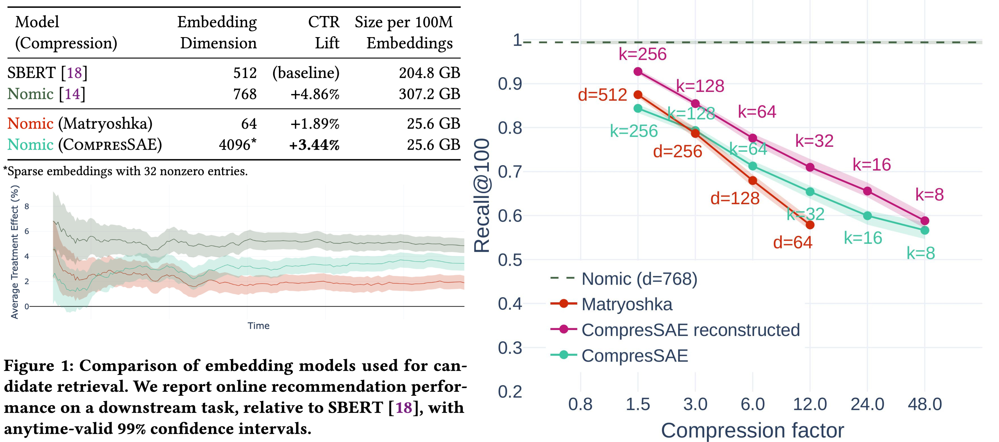

# [*The Future is Sparse*](https://arxiv.org/abs/2505.11388)
## Embedding Compression for Scalable Retrieval in Recommender Systems
 By [Recombee Research](https://www.recombee.com/research)

Recommender systems embeddings are growing. Sparsity is here to help.

Our learnable sparse compression algorithm, **CompresSAE**, achieves a superior compression-retrieval accuracy trade-off, outperforming equally sized Matryoshka embeddings and approaching uncompressed embedding performance with 12× fewer parameters.

## Model Architecture (CompresSAE)

CompresSAE is a sparse autoencoder (SAE) that maps dense embeddings into high-dimensional, sparsely activated vectors optimized for fast similarity search.

Two inference modes allow a trade-off between latency and accuracy: fast retrieval computes similarity in the sparse compressed space, while high-accuracy retrieval uses similarity in the dense reconstructed space.

See [model.py](./model.py) for implementation.

## License
[MIT License](./LICENSE)